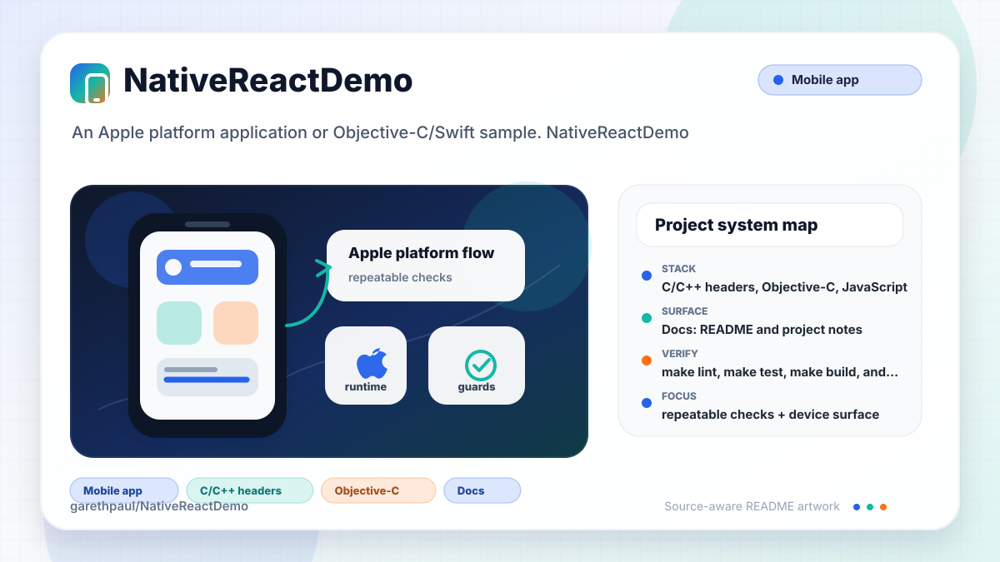

# NativeReactDemo

<!-- README-OVERVIEW-IMAGE -->


## Overview

`garethpaul/NativeReactDemo` is an Apple platform application or Objective-C/Swift sample. NativeReactDemo

This README is based on the checked-in source, manifests, scripts, and repository metadata on the `master` branch. The project language mix found during review was: C/C++ headers (7), Objective-C (3), JavaScript (1).

## Repository Contents

- `README.md` - project overview and local usage notes
- `package.json` - JavaScript dependency and script metadata
- `Crashlytics.framework` - source or example code
- `Fabric.framework` - source or example code
- `iOS` - source or example code
- `SECURITY.md` - security reporting and disclosure guidance
- `VISION.md` - project direction and maintenance guardrails
- `WowNativeReact.xcodeproj` - Xcode project file
- `WowNativeReactTests` - source or example code

Additional scan context:

- Source directories: Crashlytics.framework, Fabric.framework, WowNativeReactTests, iOS
- Dependency and build manifests: package.json
- Entry points or build surfaces: WowNativeReact.xcodeproj, package.json
- Test-looking files: WowNativeReactTests/Info.plist, WowNativeReactTests/WowNativeReactTests.m

## Getting Started

### Legacy Compatibility Baseline

- Git
- macOS with Xcode capable of opening the legacy Objective-C project
- Node.js and npm compatible with the historical React Native 0.4.2 packager

The app target pins an iOS 7.0 deployment target; the test target pins an iOS
8.2 deployment target. The shared scheme is `WowNativeReact`. These values
describe checked-in project metadata, not a promise that current Xcode, Node,
or iOS releases remain compatible. Treat modernization as a separate migration.

### Setup

```bash
git clone https://github.com/garethpaul/NativeReactDemo.git
cd NativeReactDemo
npm install
make lint
make test
make build
make check
```

The setup commands above are derived from repository files. This archived sample pins
React Native 0.4.2. A June 19, 2026 lock-only audit resolved 183 production packages
and reported 26 known vulnerabilities (6 critical, 17 high, 2 moderate, 1 low).
Do not expose its packager to untrusted networks or treat the dependency graph as
production-safe. Modernization requires a dedicated React Native migration.

### Debug Packager Launch

Debug builds load `http://localhost:8081/index.ios.bundle`. After dependencies
are installed, run `npm start`, open `WowNativeReact.xcodeproj`, select the
shared `WowNativeReact` scheme and an available iOS simulator, then Run. Keep
the historical packager bound to a trusted development machine.

### Release Bundle Boundary

Release builds load the app resource `main.jsbundle`, and the checked-in
`iOS/main.jsbundle` is a deliberate placeholder that throws instead of
registering `WowNativeReact`. Release launch therefore fails closed until a
reviewed bundle is intentionally generated and passes the existing guards.

### Manual Simulator Launch Checklist

1. Confirm `/usr/bin/make check` passes before installing legacy dependencies.
2. Use a disposable checkout/runtime because the audit has 26 vulnerabilities.
3. Run `npm start` and wait for the localhost port 8081 packager.
4. Run the shared `WowNativeReact` scheme on an available simulator.
5. Confirm the app renders `Hello World` without bundle/module errors.
6. Stop the app and packager; do not claim Release launch with the placeholder.

## Running or Using the Project

- Open `WowNativeReact.xcodeproj` in Xcode, choose the app or sample scheme, and run it on the matching simulator/device.
- Run `npm start` for the default development command.

Detected npm scripts:

- `npm run start` - `node_modules/react-native/packager/packager.sh`

## Testing and Verification

Run the canonical SDK-free gate:

```sh
/usr/bin/make check
```

- `make lint`, `make build`, and `make verify` run the SDK-free static baseline.
- `make test` and `make check` run that baseline plus 14 bounded-file,
  bundle-path, tool-resolution, hostile workflow policy, and Make-authority
  tests. The authority harness exercises 42 target/override combinations.
- The Make gates are location-independent. From another directory, pass the
  checkout's Makefile by absolute path, such as
  `make -f /path/to/NativeReactDemo/Makefile check`.
- Absolute Makefile paths containing spaces, brackets, or apostrophes retain
  the complete checkout root. `ROOT` overrides are ignored, and attempts to
  override GNU Make's `MAKEFILE_LIST` metadata fail closed.
- Repository verification rejects caller `MAKEFLAGS`, unsafe no-op/error-ignore
  modes, `MAKEFILES`, extra `-f` programs, and authority added through
  `--eval`. Caller startup programs may execute while GNU Make parses them,
  before this Makefile can reject the unsupported invocation.
- Python verification uses the fixed system interpreter with isolated startup;
  caller `PATH`, `PYTHONPATH`, `ROOT`, `SHELL`, and `PYTHON` values do not select
  verification code or tools.
- Pinned `macos-15` GitHub Actions runs that baseline and parses
  `WowNativeReact.xcodeproj` without npm install, service credentials, vendored
  script execution, build, signing, simulator launch, or application execution.
  Checkout credentials are not persisted after source retrieval.

### Hosted Verification Boundary

Hosted validation parses the project and runs static contracts without
installing React Native 0.4.2, executing vendored scripts, building, signing,
launching a simulator, or starting the packager. Manual launch requires an
isolated compatible macOS/Xcode/Node environment.
- `npm run check`
- Xcode's test action or `xcodebuild test` with the appropriate scheme and destination

When the required SDK or runtime is unavailable, use static checks and source review first, then verify on a machine that has the matching platform toolchain.
The static check verifies React Native pinning, DEBUG-only localhost bundle loading,
release `main.jsbundle` wiring, the release bundle guard, the blank bundle guard, plist/XML validity, and local secret ignore rules.

## Configuration and Secrets

- Fabric/Crashlytics credentials, signing material, local xcconfig files, `.env` files, and private endpoints should stay out of git.
- Release builds load `iOS/main.jsbundle`; the checked-in bundle is a
  placeholder, so regenerate it intentionally when JavaScript changes need to
  ship without the packager.
- The release bundle guard returns safely during launch if no JavaScript bundle URL is available.
- The placeholder bundle guard also fails closed if release startup resolves the checked-in empty bundle.
- The blank bundle guard treats missing, empty, or whitespace-only release bundle content as an unsafe placeholder.
- The bundle module guard treats release bundles without the expected `WowNativeReact` registration as unsafe.
- The release bundle file URL guard rejects non-local release bundle URLs before
  React Native startup.
- The exact bundle registration guard requires the release bundle to register
  the same `WowNativeReact` module used to create `RCTRootView`, including the
  closing quote and argument delimiter so longer prefix names cannot pass.
- Release module registration must be executable JavaScript code, not text inside comments, string literals, or regular-expression literals.
- The bundle module name guard fails registration checks closed if the expected
  React Native module name is blank or whitespace-only.
- The release bundle resource guard keeps `iOS/main.jsbundle` wired into the
  app target resources that release startup loads.
- The release bundle size guard rejects local bundles larger than 10 MiB or
  missing file-size metadata before reading JavaScript contents.
- The release bundle regular-file guard rejects symbolic links, directories,
  and unknown file types before size or content access.
- The release placeholder shape guard compares the complete normalized
  checked-in placeholder, so unrelated marker text or boundary collisions in a
  valid bundle are not rejected.
- Static validation opens required text and vendored artifacts without following
  symbolic links, enforces read/hash limits, requires the canonical
  `iOS/main.jsbundle` Xcode path, and resolves Xcode through `/usr/bin/xcrun`.

## Security and Privacy Notes

- Review changes touching authentication or token handling; examples from the scan include Crashlytics.framework/Headers/CLSLogging.h, Crashlytics.framework/Headers/CLSReport.h.
- Review changes touching external API calls or credential-adjacent configuration; examples from the scan include Crashlytics.framework/Headers/Crashlytics.h, Fabric.framework/Headers/FABAttributes.h, Fabric.framework/Headers/Fabric.h, Fabric.framework/Info.plist.
- Review changes touching network requests, sockets, or service endpoints; examples from the scan include Crashlytics.framework/Headers/Crashlytics.h, Fabric.framework/Info.plist, WowNativeReactTests/Info.plist, iOS/AppDelegate.m, and 2 more.
- Keep the release bundle guard in place when changing `iOS/AppDelegate.m` bundle loading.
- Keep the release bundle file URL guard in place so release startup only uses
  a local `main.jsbundle`.
- Keep the exact bundle registration guard in place so malformed release
  bundles cannot satisfy module checks with unrelated strings or longer names
  that merely start with `WowNativeReact`.
- Keep the bundle module name guard in place so blank expected module names do
  not satisfy release bundle checks.
- Keep the release bundle resource guard in place so release builds still ship
  the local `main.jsbundle` file.
- Keep the release bundle size guard in place so corrupted or accidentally huge
  resources cannot be read into memory before validation.
- Keep the release bundle regular-file guard in place so link metadata cannot
  bypass the pre-read size boundary.
- Vendored framework integrity checks verify the recorded SHA-256 hashes for
  Fabric, Crashlytics, and their executable build tools before project parsing.
- Review changes touching mobile permissions or privacy-sensitive device data; examples from the scan include Crashlytics.framework/Headers/Crashlytics.h.
- Review changes touching file, media, JSON, XML, CSV, OCR, or data parsing; examples from the scan include Crashlytics.framework/Headers/Crashlytics.h, Fabric.framework/Info.plist, WowNativeReactTests/Info.plist, iOS/Info.plist, and 1 more.

## Maintenance Notes

- This looks like an Apple platform project or sample. Xcode, Swift, CocoaPods, and deployment target versions may need to match the original project era.
- Run `make lint`, `make test`, `make build`, and `make check` before pushing
  JavaScript, plist, Xcode project, dependency, or security documentation
  changes.
- Use an absolute Makefile path when running those gates outside the checkout.
- See `docs/plans/2026-06-09-make-gate-aliases.md` for the local gate alias
  baseline.
- See `docs/plans/2026-06-09-bundle-module-name-guard.md` for the bundle module
  name guardrail.
- See `SECURITY.md` for vulnerability reporting and safe research guidance.
- See `VISION.md` for project direction and contribution guardrails.

## Contributing

Keep changes small and tied to the project that is already present in this repository. For code changes, document the toolchain used, avoid committing generated dependency directories or local configuration, and update this README when setup or verification steps change.
